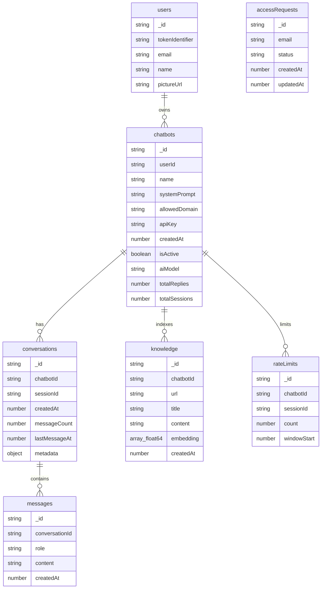

# Convex Database ERD (Backend Developer View)

Dokumen ini menjelaskan model data Convex dengan level abstraksi yang praktis untuk backend developer: tabel apa saja, relasinya, siapa yang write/read, dan kenapa struktur itu dipakai.

## ERD

## Convex Tables and Purpose

### users

- Menyimpan mirror data identitas dari Clerk agar query internal lebih mudah.
- Key unik: `tokenIdentifier` (subject dari Clerk token).
- Writer utama: `users.syncCurrentUser`.
- Reader utama: `users.getCurrentUser`.

### chatbots

- Entitas utama tenant-level bot milik user.
- Menyimpan konfigurasi runtime:
  - prompt dasar
  - allowed domain
  - API key public widget
  - model AI (`groq` atau `deepseek`)
- Writer utama: `chatbots.createChatbot`, `chatbots.updateChatbot`, `chatbots.deleteChatbot`.
- Reader utama: `chatbots.listChatbots`, `chatbots.getChatbot`, `chatbots.getDashboardStats`.

### conversations

- Session-level container untuk satu pengunjung pada satu chatbot.
- Kunci penting: komposit `(chatbotId, sessionId)` via index `by_session`.
- Menyimpan metadata pengunjung (language, platform, viewport, referrer, url).
- Writer utama: `conversations.getOrCreate`, `conversations.updateConversationMetadata`.
- Reader utama: `conversations.listByBot`, `conversations.getConversation`.

### messages

- Menyimpan log chat berurutan untuk conversation.
- Role: `user` / `assistant`.
- Writer utama:
  - `messages.prepareSend` (insert user message)
  - `messages.saveResponse` (insert assistant message)
- Reader utama: `conversations.getMessages`.

### knowledge

- Chunk knowledge per chatbot untuk retrieval berbasis vector search.
- Field penting:
  - `content` = chunk teks markdown
  - `embedding` = vector 3072 dimensi
- Vector index: `by_embedding` dengan filter `chatbotId`.
- Writer utama:
  - `knowledge.searchAndEmbed` via `knowledgeData.saveKnowledge`
  - `knowledge.editKnowledge` via `knowledgeData.updateKnowledgeData`
- Reader utama:
  - `knowledgeData.getKnowledge`
  - `messages.send` (vector retrieval)

### rateLimits

- Menyimpan counter per `(chatbotId, sessionId)` untuk 50 pesan per 1 jam.
- Writer utama: `messages.prepareSend` (juga tersedia helper `rateLimit.checkAndIncrement`).
- Reader utama: `rateLimit.listByChatbot`.
- Maintenance: `rateLimit.deleteOne`, `rateLimit.deleteAllByChatbot`.

### accessRequests

- Menyimpan workflow approval akses dashboard berdasarkan email.
- Status enum: `pending`, `approved`, `rejected`.
- Writer utama: `access.requestAccess`, `access.updateAccessStatus`, `access.deleteAccessRequest`.
- Reader utama: `access.getAccessStatus`, `access.getPendingRequests`.

## Practical Relationship Notes

1. `users -> chatbots`
   - Di schema tidak pakai FK native SQL, tapi tetap konsisten secara aplikasi lewat `userId = identity.subject`.
2. `chatbots -> conversations -> messages`
   - Ini jalur utama observability chat runtime.
   - Hapus chatbot perlu cascade cleanup manual (sudah dilakukan di mutation).
3. `chatbots -> knowledge`
   - Isolation RAG dilakukan dengan filter `chatbotId` saat vector search.
4. `chatbots + sessionId -> rateLimits`
   - Limit dihitung per session browser, bukan per akun user.

## Write Path (Who Changes What)

- Dashboard admin mostly menulis `chatbots`, `knowledge`, `accessRequests` (admin page), dan delete/cleanup conversation data.
- Widget runtime mostly menulis `conversations`, `messages`, `rateLimits`.
- AI layer tidak menulis tabel baru, hanya menambah baris `messages` assistant dan update statistik chatbot.

## Indexes yang Kritis

- `chatbots.by_user`: list bot per owner.
- `chatbots.by_apiKey`: autentikasi widget via API key.
- `conversations.by_session`: lookup session cepat.
- `messages.by_conversation`: timeline chat.
- `knowledge.by_embedding`: semantic retrieval.
- `rateLimits.by_session`: enforcement throttle.
- `accessRequests.by_email`: authz check di middleware.

## Konsekuensi untuk Pengembangan

- Setiap perubahan field schema harus dicek dampaknya ke:
  - generated Convex types
  - query/mutation args
  - halaman dashboard dan widget hook
- Jika menambah status/error baru, sinkronkan handling di widget `use-chat-actions` dan dashboard monitor.
- Jika mengubah relasi, pastikan cleanup path delete masih complete untuk menghindari data orphan.
