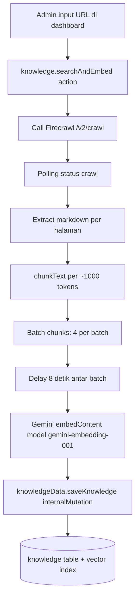
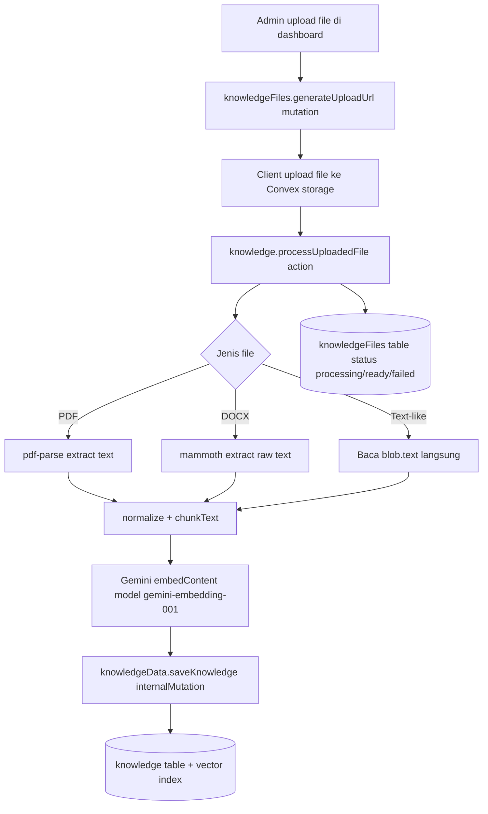
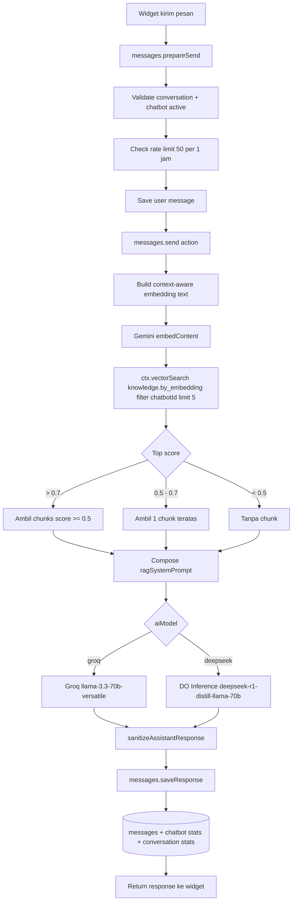

# RAG Pipeline

Dokumen ini memetakan alur RAG dari ingestion sampai answer generation pada `packages/backend/convex/knowledge.ts` dan `packages/backend/convex/messages.ts`.

## 1) Ingestion Pipeline (Admin-triggered)

### Catatan Implementasi

- Crawl depth dibatasi (`maxDiscoveryDepth: 1`) untuk menghindari ledakan jumlah halaman.
- Chunking berbasis paragraf agar konteks tetap natural.
- Batch + delay dipakai untuk menahan risiko rate-limit embedding API.
- Source file dan source website masuk ke vector index `knowledge` yang sama agar retrieval tetap konsisten.
- File teks sederhana seperti `txt`, `md`, `csv`, `tsv`, `json`, `log`, `html`, `xml`, `yaml`, `ini`, `conf`, `env` dibaca tanpa library parsing tambahan.
- PDF diekstrak lokal dengan `pdf-parse`.
- DOCX diekstrak lokal dengan `mammoth`.
- Gemini hanya dipakai untuk embedding, bukan untuk ekstraksi isi file.

## 2) Retrieval + Generation Pipeline (Per Message)

## 3) Retrieval Decision Logic

Algoritma seleksi context saat vector search:

1. Ambil top result score.
2. Jika `score > 0.7`: aktifkan RAG penuh (beberapa chunk).
3. Jika `0.5 <= score <= 0.7`: context tipis (hanya chunk teratas).
4. Jika `< 0.5`: jangan inject context agar jawaban tetap natural.

Tujuan: menekan hallucination context dan mencegah prompt dipenuhi dokumen yang tidak relevan.

## 4) Defensive Prompting Strategy

Prompt gabungan menggunakan pola:

- system prompt asli chatbot
- instruksi eksplisit "gunakan knowledge hanya jika relevan"
- daftar sumber `Source (url)` berisi chunk

Dampak:

- greeting/small talk tidak dipaksa menjawab dari knowledge
- pertanyaan faktual terkait dokumen tetap bisa ditopang sumber

## 5) Failure Behavior

Jika RAG gagal (embedding atau vector search error):

- pipeline tidak memblokir chat
- sistem fallback ke LLM tanpa custom knowledge
- error dicatat dengan warning log

Ini menjaga chat tetap tersedia walaupun pipeline knowledge sedang bermasalah.

## 6) Modul yang Terlibat

- `packages/backend/convex/knowledge.ts`
- `packages/backend/convex/knowledgeData.ts`
- `packages/backend/convex/knowledgeFiles.ts`
- `packages/backend/convex/messages.ts`
- `packages/backend/convex/schema.ts` (vector index `knowledge.by_embedding`)
