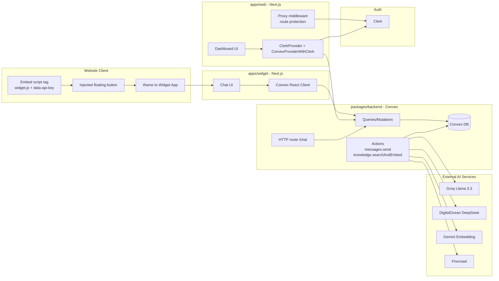
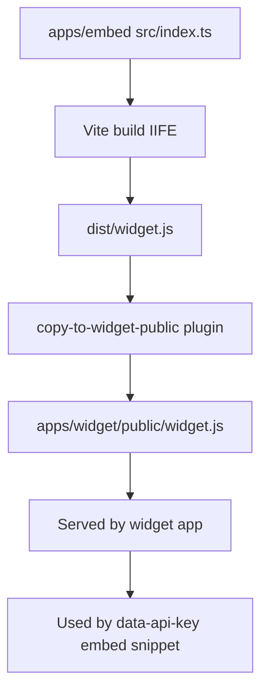
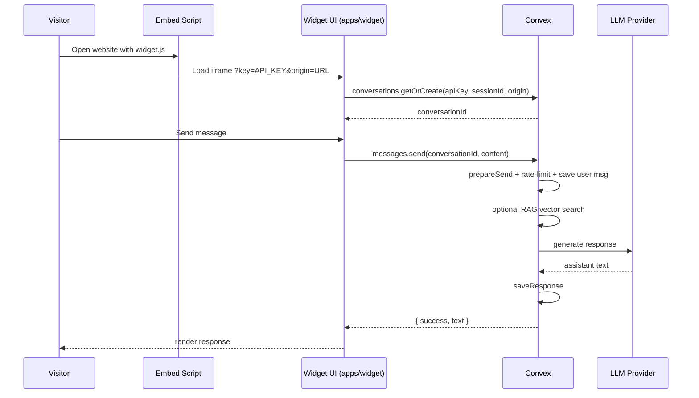
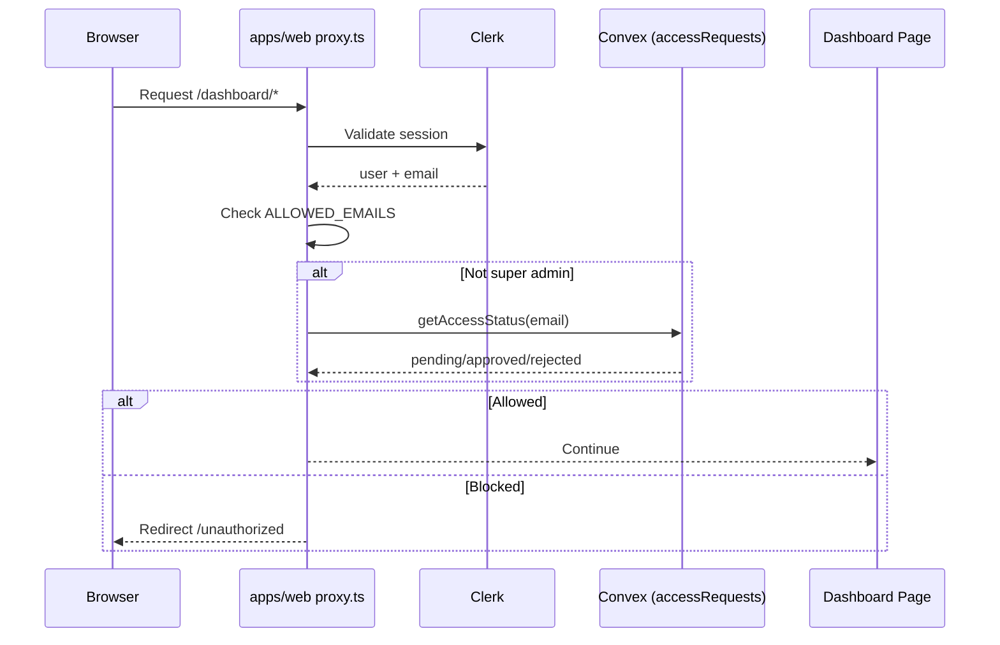

# System Architecture Diagram

## High-Level Component Map

```mermaid
flowchart LR
    subgraph ClientSite[Website Client]
      A[Embed script tag\nwidget.js + data-api-key]
      B[Injected floating button]
      C[Iframe to Widget App]
    end

    subgraph WidgetApp[apps/widget - Next.js]
      D[Chat UI]
      E[Convex React Client]
    end

    subgraph AdminApp[apps/web - Next.js]
      F[Dashboard UI]
      G[ClerkProvider + ConvexProviderWithClerk]
      H[Proxy middleware\nroute protection]
    end

    subgraph Backend[packages/backend - Convex]
      I[(Convex DB)]
      J[Queries/Mutations]
      K[Actions\nmessages.send\nknowledge.searchAndEmbed]
      L[HTTP route /chat]
    end

    subgraph AI[External AI Services]
      M[Groq Llama 3.3]
      N[DigitalOcean DeepSeek]
      O[Gemini Embedding]
      P[Firecrawl]
    end

    subgraph Auth[Auth]
      Q[Clerk]
    end

    A --> B --> C --> D --> E
    E --> J
    F --> G --> J
    H --> Q
    G --> Q

    J --> I
    K --> I
    L --> J
    K --> M
    K --> N
    K --> O
    K --> P
```

## Build-Time and Artifact Flow

```mermaid
flowchart TD
    A[apps/embed src/index.ts] --> B[Vite build IIFE]
    B --> C[dist/widget.js]
    C --> D[copy-to-widget-public plugin]
    D --> E[apps/widget/public/widget.js]
    E --> F[Served by widget app]
    F --> G[Used by data-api-key embed snippet]
```

## Request Lifecycle: Widget Message

```mermaid
sequenceDiagram
    participant U as Visitor
    participant S as Embed Script
    participant W as Widget UI (apps/widget)
    participant C as Convex
    participant AI as LLM Provider

    U->>S: Open website with widget.js
    S->>W: Load iframe ?key=API_KEY&origin=URL
    W->>C: conversations.getOrCreate(apiKey, sessionId, origin)
    C-->>W: conversationId
    U->>W: Send message
    W->>C: messages.send(conversationId, content)
    C->>C: prepareSend + rate-limit + save user msg
    C->>C: optional RAG vector search
    C->>AI: generate response
    AI-->>C: assistant text
    C->>C: saveResponse
    C-->>W: { success, text }
    W-->>U: render response
```

## Request Lifecycle: Dashboard Protected Route

```mermaid
sequenceDiagram
    participant B as Browser
    participant M as apps/web proxy.ts
    participant K as Clerk
    participant C as Convex (accessRequests)
    participant P as Dashboard Page

    B->>M: Request /dashboard/*
    M->>K: Validate session
    K-->>M: user + email
    M->>M: Check ALLOWED_EMAILS
    alt Not super admin
      M->>C: getAccessStatus(email)
      C-->>M: pending/approved/rejected
    end
    alt Allowed
      M-->>P: Continue
    else Blocked
      M-->>B: Redirect /unauthorized
    end
```
