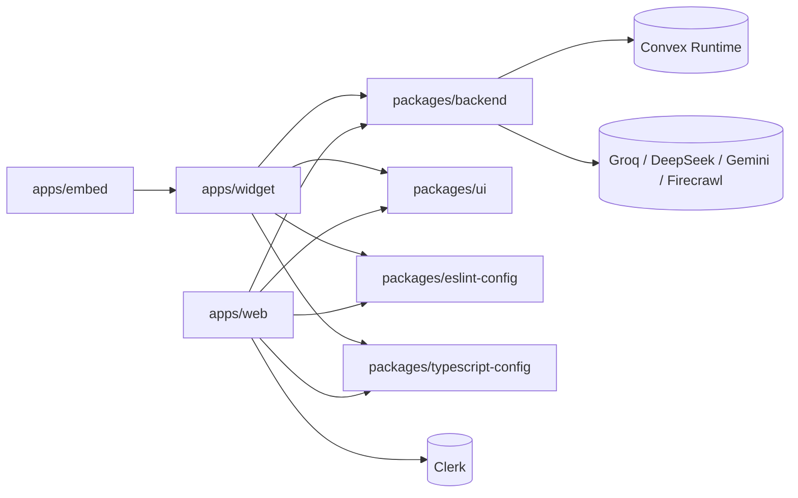

# Repository Map

Dokumen ini berisi peta monorepo secara repository-centric: setiap folder utama, tanggung jawabnya, dan hubungan antar package.

## Dependency Graph Antar Repository



## Struktur Folder Lengkap (Source-Oriented)

```text
shadcn-monorepo/
├── apps/
│   ├── web/                             # Dashboard admin (Next.js)
│   │   ├── app/
│   │   │   ├── layout.tsx               # Root providers (Clerk + Convex + theme)
│   │   │   ├── page.tsx                 # Landing page
│   │   │   ├── preview/[id]/page.tsx    # Standalone widget preview page
│   │   │   ├── sign-in/[[...sign-in]]/  # Clerk sign-in route
│   │   │   ├── sign-up/[[...sign-up]]/  # Clerk sign-up route
│   │   │   ├── support/page.tsx         # Placeholder support page
│   │   │   ├── unauthorized/page.tsx    # Access request/status page
│   │   │   └── dashboard/
│   │   │       ├── layout.tsx           # Dashboard shell + admin flag
│   │   │       ├── page.tsx             # Overview + charts
│   │   │       ├── admin/requests/      # Access request management
│   │   │       └── chatbots/
│   │   │           ├── page.tsx         # Chatbot list
│   │   │           ├── new/page.tsx     # Create chatbot
│   │   │           ├── _components/     # Shared detail components
│   │   │           └── [id]/
│   │   │               ├── layout.tsx
│   │   │               ├── page.tsx
│   │   │               ├── conversations/
│   │   │               ├── embed/
│   │   │               ├── knowledge/
│   │   │               ├── rate-limit/
│   │   │               └── settings/
│   │   ├── components/                  # Sidebar, dashboard shell, home content
│   │   ├── lib/ConvexClientProvider.tsx
│   │   ├── proxy.ts                     # Clerk middleware + access control
│   │   ├── .env.local.example           # Template env dashboard
│   │   ├── package.json
│   │   └── next.config.mjs
│   │
│   ├── widget/                          # Chat widget app (Next.js)
│   │   ├── app/
│   │   │   ├── layout.tsx
│   │   │   └── page.tsx                 # Chat interface entry
│   │   ├── components/
│   │   │   ├── chat-header.tsx
│   │   │   ├── message-list.tsx
│   │   │   ├── message-input.tsx
│   │   │   ├── name-prompt-modal.tsx
│   │   │   ├── rate-limit-alert.tsx
│   │   │   ├── widget-error-alert.tsx
│   │   │   ├── clear-confirm-modal.tsx
│   │   │   └── convex-client-provider.tsx
│   │   ├── hooks/
│   │   │   ├── use-conversation-init.ts
│   │   │   ├── use-chat-actions.ts
│   │   │   ├── use-message-state.ts
│   │   │   ├── use-rate-limit.ts
│   │   │   └── use-chat-scroll.ts
│   │   ├── lib/types.ts
│   │   ├── public/widget.js             # Artifact hasil build apps/embed
│   │   ├── .env.local.example           # Template env widget runtime
│   │   └── package.json
│   │
│   └── embed/                           # Build-only embed script builder (Vite, non-deploy target)
│       ├── src/index.ts                 # Floating launcher + iframe injection
│       ├── vite.config.ts               # IIFE build + auto copy ke widget/public
│       └── package.json
│
├── packages/
│   ├── backend/                         # Convex backend
│   │   ├── convex/
│   │   │   ├── schema.ts
│   │   │   ├── auth.config.ts
│   │   │   ├── http.ts
│   │   │   ├── chatbots.ts
│   │   │   ├── conversations.ts
│   │   │   ├── messages.ts
│   │   │   ├── knowledge.ts
│   │   │   ├── knowledgeData.ts
│   │   │   ├── rateLimit.ts
│   │   │   ├── users.ts
│   │   │   ├── access.ts
│   │   │   └── _generated/             # Convex codegen output
│   │   └── package.json
│   │
│   ├── ui/                              # Shared UI library + CSS tokens
│   │   ├── src/components/
│   │   ├── src/hooks/
│   │   ├── src/lib/
│   │   ├── src/styles/globals.css
│   │   └── package.json
│   │
│   ├── eslint-config/                   # Shared ESLint presets
│   │   ├── base.js
│   │   ├── next.js
│   │   ├── react-internal.js
│   │   └── package.json
│   │
│   └── typescript-config/               # Shared tsconfig presets
│       ├── base.json
│       ├── nextjs.json
│       ├── react-library.json
│       └── package.json
│
├── .env.local.example               # Root tooling env template (bukan runtime app)
├── package.json
├── pnpm-workspace.yaml
├── turbo.json
└── README.md
```

## Repository Summary

| Repository                 | Tujuan Utama                                                            | Runtime                         |
| -------------------------- | ----------------------------------------------------------------------- | ------------------------------- |
| apps/web                   | Dashboard admin, auth, observability chatbot                            | Next.js + Clerk + Convex client |
| apps/widget                | UI chat publik di iframe                                                | Next.js + Convex client         |
| apps/embed                 | Generate `widget.js` embeddable script dan copy ke `apps/widget/public` | Build-only (tidak dideploy)     |
| packages/backend           | Data model + business logic + AI orchestration                          | Convex runtime                  |
| packages/ui                | Shared UI primitive + style tokens                                      | TypeScript package              |
| packages/eslint-config     | Shared lint config untuk seluruh workspace                              | Tooling                         |
| packages/typescript-config | Shared tsconfig preset                                                  | Tooling                         |

Catatan deployment: yang dideploy sebagai runtime service adalah `apps/web`, `apps/widget`, dan backend Convex. `apps/embed` hanya dipakai saat build artifact.

## Dokumen Detail per Repository

- [apps/web](./apps-web/README.md)
- [apps/widget](./apps-widget/README.md)
- [apps/embed](./apps-embed/README.md)
- [packages/backend](./packages-backend/README.md)
- [packages/ui](./packages-ui/README.md)
- [packages/eslint-config](./packages-eslint-config/README.md)
- [packages/typescript-config](./packages-typescript-config/README.md)
