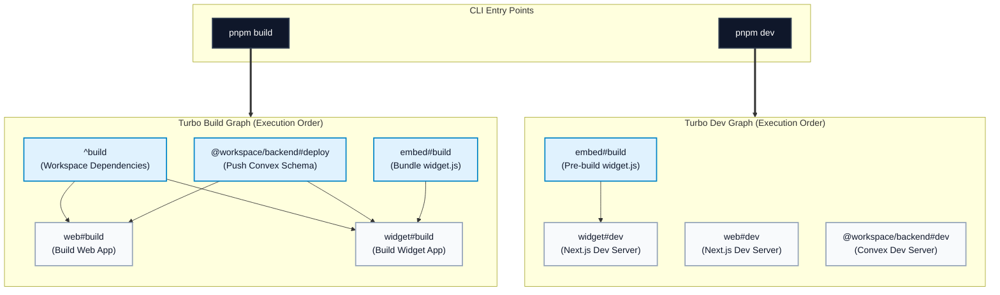

# Turbo Workflow and Dependency Graph

Dokumen ini menjelaskan bagaimana Turborepo pada monorepo ini mengorkestrasi semua task build/dev/lint/typecheck, berdasarkan konfigurasi di `turbo.json`.

## Kenapa Penting

Di repo ini, command root seperti `pnpm build` dan `pnpm dev` bukan hanya menjalankan satu script sederhana.
Command tersebut memicu Turbo task graph yang mempertimbangkan:

- dependency antar package workspace
- aturan `dependsOn` di task
- env yang memengaruhi cache
- output artifact yang bisa di-cache
- task persistent untuk development

## Root Scripts dan Pemetaannya

Di root `package.json`:

- `pnpm build` -> `turbo build`
- `pnpm dev` -> `turbo dev`
- `pnpm lint` -> `turbo lint`
- `pnpm format` -> `turbo format`
- `pnpm typecheck` -> `turbo typecheck`

Artinya, entry point utama operasional monorepo memang lewat root scripts.

## Struktur Task di turbo.json

Task kunci yang dipakai:

1. `build`
2. `web#build`
3. `widget#build`
4. `@workspace/backend#deploy`
5. `dev`
6. `widget#dev`
7. `lint`
8. `format`
9. `typecheck`

## Alur turbo build

### 1) Task generic build

Task `build` punya:

- `dependsOn: ["^build"]`
- `inputs: ["$TURBO_DEFAULT$", ".env*"]`
- `outputs: [".next/**", "!.next/cache/**", "dist/**"]`
- daftar env runtime/build yang dipropagasikan ke task

Makna praktis:

- `^build` artinya: sebelum build package saat ini, build dulu dependency workspace-nya.
- perubahan file env ikut dianggap input cache.
- output build akan disimpan/dipakai untuk cache Turbo.

### 2) Override task web#build

`web#build`:

- `dependsOn: ["^build", "@workspace/backend#deploy"]`

Makna:

- selain build dependency biasa, build web juga menunggu backend deploy task selesai.

### 3) Override task widget#build

`widget#build`:

- `dependsOn: ["^build", "embed#build", "@workspace/backend#deploy"]`

Makna:

- widget build menunggu:
  - dependency build biasa
  - embed build (agar `widget.js` fresh)
  - backend deploy task

Ini yang membuat build widget otomatis sinkron dengan artifact embed.

## Alur turbo dev

Task `dev` diset:

- `cache: false`
- `persistent: true`
- env list disediakan

Makna:

- dev server tidak menggunakan cache task output.
- task dianggap long-running process.

Task tambahan:

- `widget#dev` punya `dependsOn: ["embed#build"]`

Makna:

- saat menjalankan dev untuk widget, Turbo memaksa build embed dulu sekali agar `apps/widget/public/widget.js` tersedia.

## Visual Task Graph

## Bagaimana Dependency Workspace Dibaca Turbo

Turbo menggunakan dua sumber dependency:

1. graph package workspace dari pnpm workspace + dependency internal `workspace:*`
2. graph task dari `dependsOn` di `turbo.json`

Contoh di repo ini:

- `web` bergantung pada `@workspace/backend` dan `@workspace/ui`
- `widget` bergantung pada `@workspace/backend` dan `@workspace/ui`

Maka saat `^build`, Turbo akan memastikan package dependency tersebut diproses dulu.

## Bagaimana pnpm dan Turbo Saling Melengkapi

### pnpm

- mengelola workspace package (`apps/*`, `packages/*`)
- membuat linking dependency lokal untuk `workspace:*`
- menjaga lockfile tunggal di root

### Turbo

- mengorkestrasi urutan eksekusi task lint/build/dev/typecheck
- melakukan cache berdasar input/output/env task
- mengeksekusi task override khusus per package (mis. `widget#build`)

## Command yang Disarankan

### Orkestrasi penuh dari root

- `pnpm dev`
- `pnpm build`
- `pnpm lint`
- `pnpm typecheck`

### Per package (targeted run)

- `pnpm dev --filter web`
- `pnpm build --filter web`
- `pnpm dev --filter widget`
- `pnpm build --filter widget`
- `pnpm build --filter embed`

## Apakah Targeted Run Tetap Diorkestrasi?

Iya. Targeted run per repo tetap diorkestrasi oleh Turbo, selama command dijalankan lewat root script Turbo + `--filter`.

`--filter` hanya mempersempit target awal task, bukan mematikan dependency graph.
Aturan `dependsOn` dan `^build` tetap berlaku.

Contoh praktis di repo ini:

- `pnpm build --filter widget` tetap bisa menarik dependency task `embed#build` dan `@workspace/backend#deploy` karena didefinisikan di `widget#build.dependsOn`.
- `pnpm dev --filter widget` tetap menjalankan dependency `embed#build` karena `widget#dev.dependsOn` mengharuskan itu.
- `pnpm build --filter web` tetap menghormati `^build` dan dependency `@workspace/backend#deploy` dari `web#build`.

Jadi secara konsep:

- Root run (`pnpm build`) = orkestrasi global seluruh workspace.
- Targeted run (`pnpm build --filter <repo>`) = orkestrasi terfokus, tapi dependency terkait tetap ikut diproses.

## Catatan untuk apps/embed

`apps/embed` di repo ini adalah build pipeline, bukan deployment runtime service.
Peran utamanya menghasilkan `widget.js` minified/bundled dan menyalinkannya ke `apps/widget/public/widget.js`.

## Checklist Validasi Jika Mengubah turbo.json

1. Pastikan `pnpm build` dari root tetap menyelesaikan artifact `apps/widget/public/widget.js`.
2. Pastikan `pnpm dev` dari root tetap bisa menjalankan web + widget + backend sesuai ekspektasi.
3. Cek apakah env baru perlu ditambahkan ke daftar `env` pada task terkait.
4. Jika menambah task package-specific baru, pastikan dependency graph tidak membentuk deadlock.
